# Flutter E-Commerce UI Template

A polished Flutter e-commerce app template with onboarding, authentication, shop browsing, cart, checkout, wishlist, orders, and profile screens. Built with **GetX**, **Material 3**, and full **light/dark theme** support.

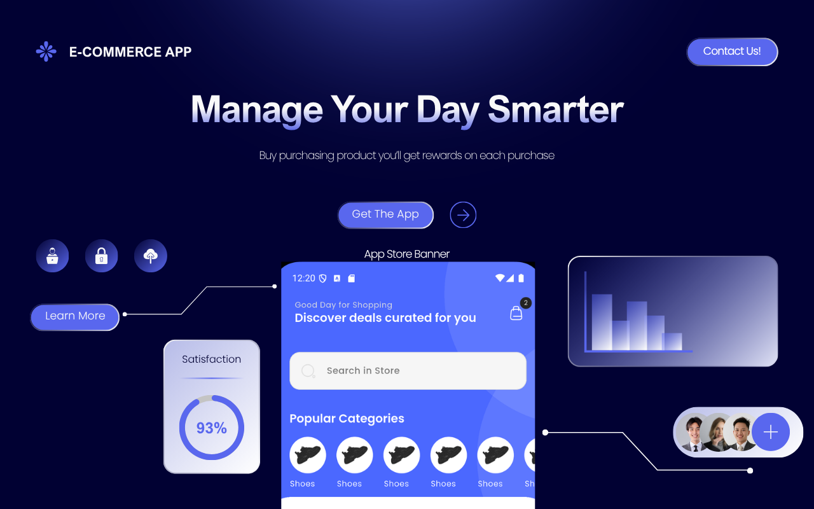

## ✨ Highlights

- 🎨 Clean, modern e-commerce UI with Material 3 design
- 🌓 Light & dark theme support out of the box
- 🧭 GetX for state management and navigation
- 🧩 Feature-based folder structure for easy customization
- 📱 Responsive across phones and tablets

## Platforms

| Platform | Status |
|----------|--------|
| Android  | Supported (API 21+) |
| iOS      | Supported (iOS 12+) |

> **UI-only template** — no backend included. Connect your own API via `lib/services/http_service.dart`.

## Requirements

- Flutter SDK `>=3.2.3`
- Dart SDK `>=3.2.3`
- Android Studio / Xcode for device builds

## Quick Start

```bash
# 1. Get dependencies
flutter pub get

# 2. Run on a connected device or emulator
flutter run
```

### Clean clone test

```bash
flutter clean
flutter pub get
flutter analyze
flutter run
```

## Project Structure

lib/

├── main.dart                 # App entry point

├── app.dart                  # Root GetMaterialApp + theme setup

├── navigation_menu.dart      # Bottom navigation shell (Home/Store/Wishlist/Profile)

│

├── models/                   # Data models (ProductModel, etc.)

├── services/                 # API / network layer (HttpService)

├── widgets/                  # Reusable UI components (app bar, product cards, etc.)

├── styles/                   # Shared layout styles

│

├── features/                 # Feature modules (screens grouped by domain)

│   ├── authentication/       # Onboarding, login, signup, password reset

│   ├── shop/                  # Home, store, cart, checkout, product details

│   └── personalization/       # Profile, settings, addresses

│

└── utils/                    # Constants, theme, helpers, validators

├── constants/

├── theme/

├── validators/

└── helpers/


### Where to find things

| You need… | Look in… |
|-----------|----------|
| Screens | `lib/features/<feature>/screens/` |
| Reusable widgets | `lib/widgets/` |
| Data models | `lib/models/` |
| API calls | `lib/services/http_service.dart` |
| Colors, text, images | `lib/utils/constants/` |
| Form validation | `lib/utils/validators/validation.dart` |

## App Flow

1. **Onboarding** → swipe through 3 intro pages
2. **Login / Signup** → validated forms with social button links
3. **Navigation Menu** → Home, Store, Wishlist, Profile tabs
4. **Shop** → browse products, view details, add to cart, checkout

## Screens Included

| # | Screen | Description |
|---|--------|--------------|
| 1 | Onboarding | 3-page intro carousel |
| 2 | Login / Signup | Authentication UI with form validation |
| 3 | Home | Banners, categories, featured products |
| 4 | Store | Full product listing with filters |
| 5 | Product Details | Product info, images, variants |
| 6 | Cart | Cart items, quantity controls, totals |
| 7 | Checkout | Address & payment method UI |
| 8 | Wishlist | Saved/favorited products |
| 9 | Orders | Order history screen |
| 10 | Profile | User account & settings |

*(Adjust this table if any screen names/order differ from your actual `features/` folders)*

## Customization

| What to change | File |
|----------------|------|
| App strings | `lib/utils/constants/text_strings.dart` |
| Colors | `lib/utils/constants/colors.dart` |
| Images / logos | `lib/utils/constants/image_strings.dart` + `assets/` |
| API base URL | `lib/services/http_service.dart` |
| Social login URLs | `lib/utils/constants/link_strings.dart` |

## Assets

All images, fonts, and icons live under `assets/`. Paths are registered in `pubspec.yaml`.

## 📱 Screenshots

<p align="center">
  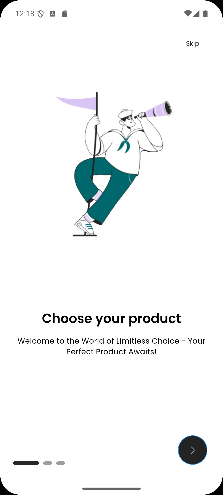
  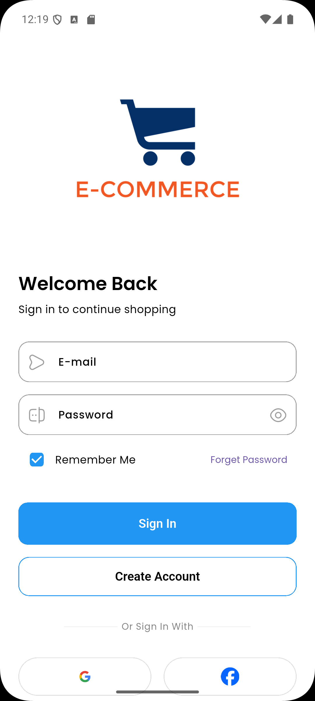
  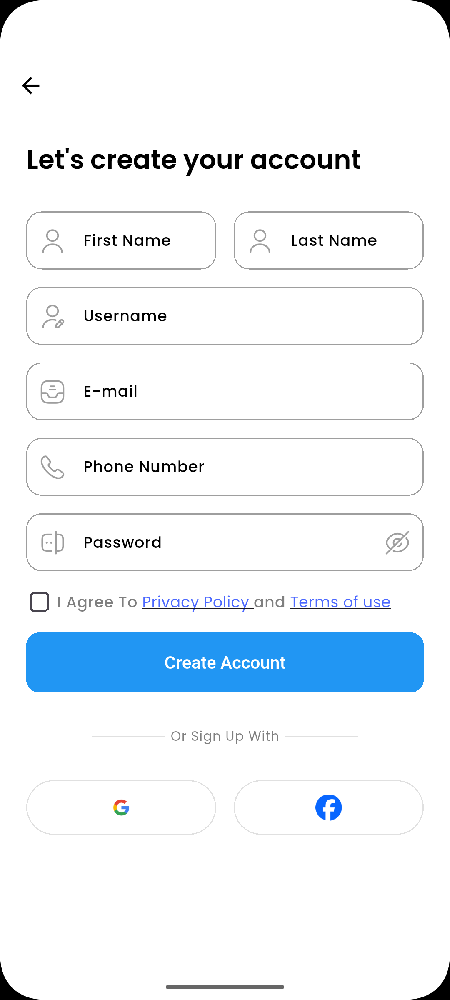
  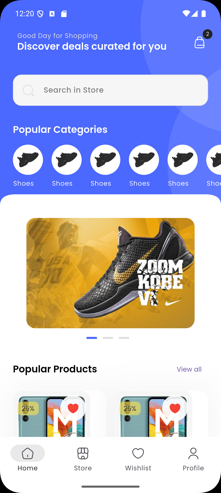
</p>
<p align="center">
  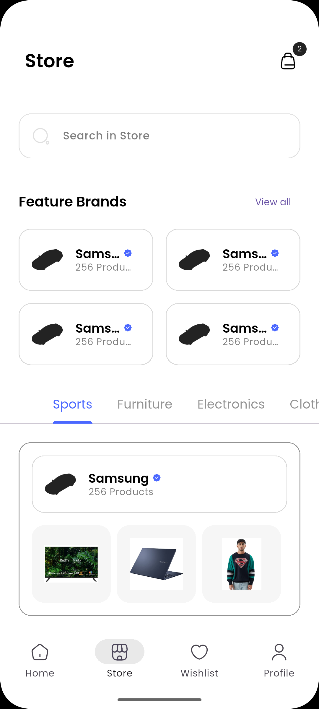
  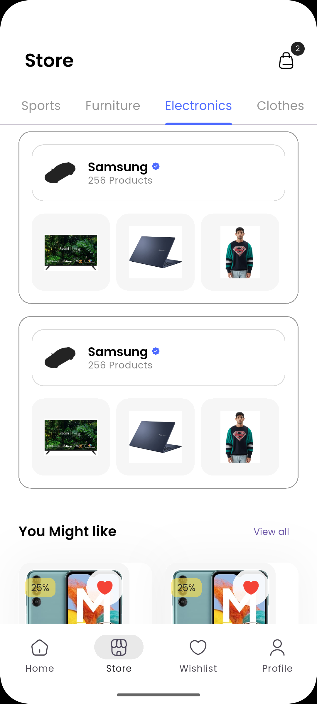
  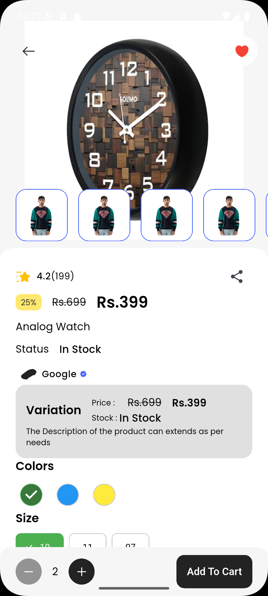
  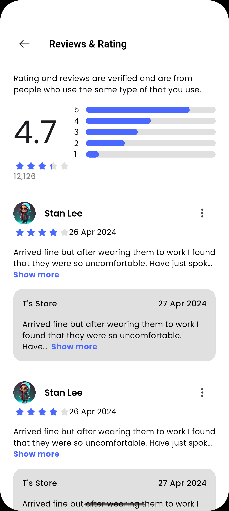
</p>
<p align="center">
  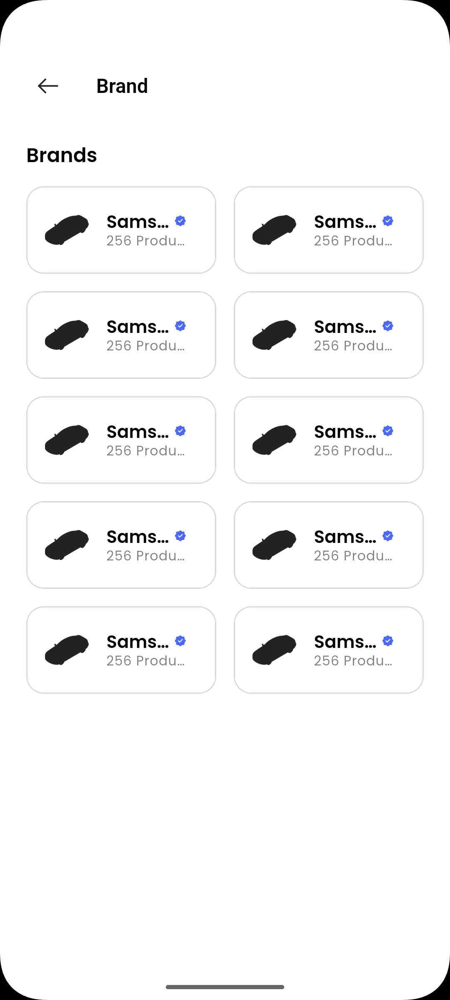
  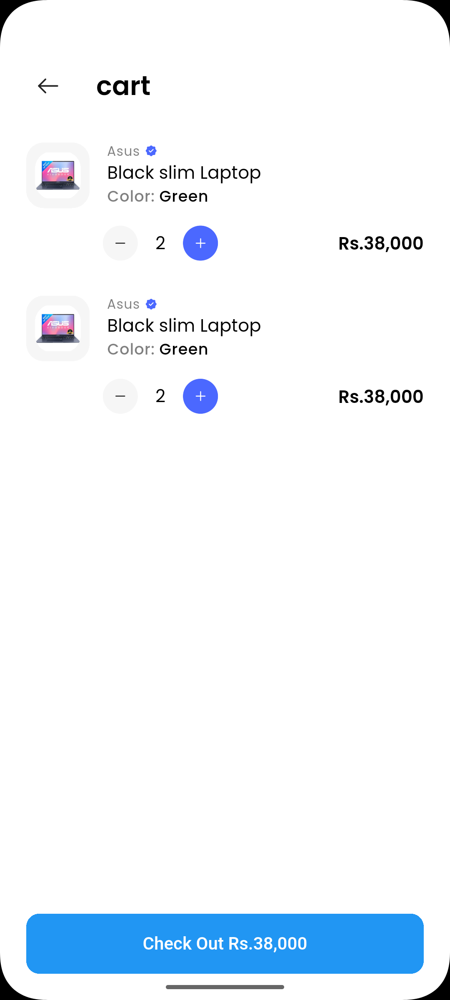
  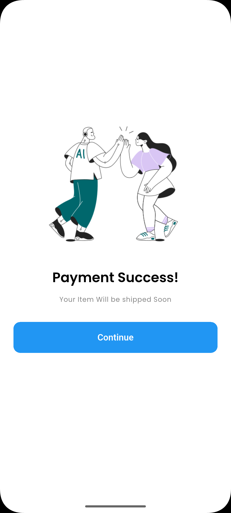
  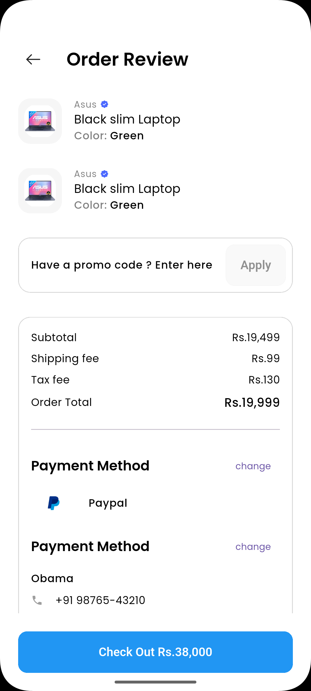
</p>
<p align="center">
  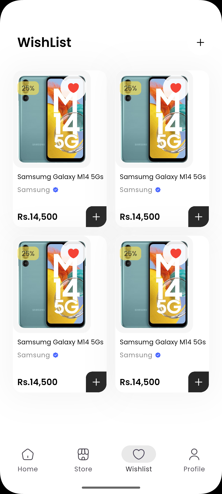
  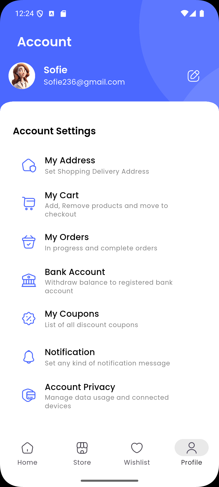
  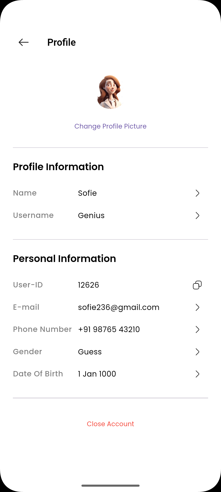
</p>

## Dependencies

- **get** — state management & navigation
- **iconsax** — icon set
- **carousel_slider** — promo banners
- **url_launcher** — social login links
- **http** — REST API helper (ready for your backend)

## Notes for Buyers

- Authentication is **UI-only** (no Firebase/backend wired up)
- Product data is **static/demo content** in widgets — replace with your own API calls
- Update `HttpService.baseUrl` before connecting a live backend
- Run `flutter pub get` after extracting the zip

## License

Provided as a commercial template. You may customize and publish it under your own app listing. Resale or redistribution of the raw source code itself is not permitted.

## Support

Questions or customization help? Reach out via [rmuni936@gmail.com] or your Gumroad message inbox.

---

